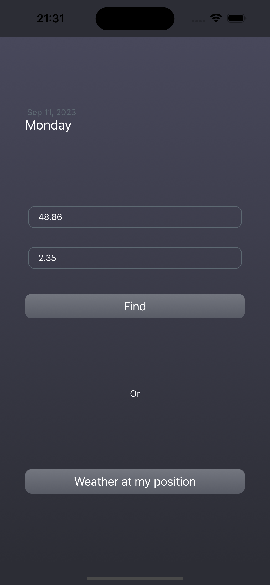
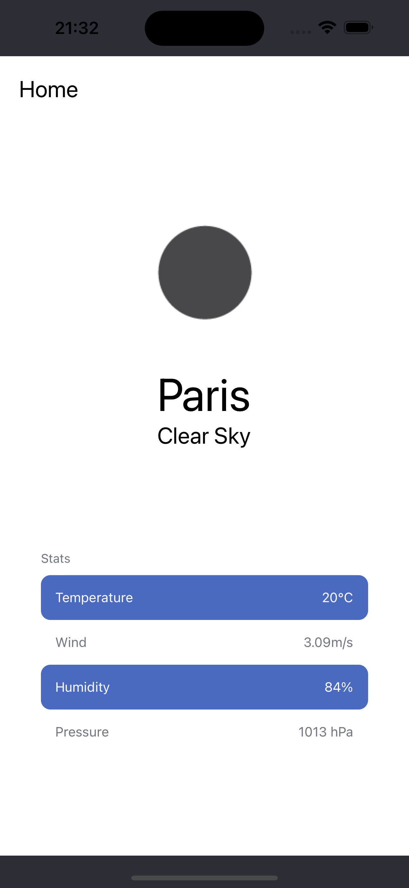

# Weather App with React Native and Test-Driven Development (TDD)

This React Native application is designed to provide users with real-time weather information based on either their device's location or a specified latitude and longitude. This project was developed following the principles of Test-Driven Development (TDD) to ensure code quality and reliability.

## Project Overview

This Weather App consists of two screens:

1. **Location Input Screen**: This is the initial screen where users can either:

   - Input latitude and longitude coordinates.
   - Use the "Weather at my position" button to automatically fetch the device's current location.

2. **Weather Display Screen**: After providing location information on the first screen, users are directed to this screen. It displays the weather conditions for the specified location. If the user opted for the device's location, it will display the weather for the current device location.

## Technology Stack

The Weather App is built using the following technologies and libraries:

- React Native: A popular framework for building cross-platform mobile applications.
- Redux: For managing the application's state.
- react-redux: To integrate Redux with the React Native application.
- redux-saga: For managing side-effects and asynchronous actions.
- Jest and @testing-library/react-native: For unit and integration testing.

## Getting Started

Follow these steps to set up and run the Weather App on your local development environment:

1. **Clone the Repository**:

   ```bash
   git clone https://github.com/your-username/weather-app.git
   cd weather-app
   ```

2. **Install the dependencies**:

   ```bash
   yarn install
   ```

3. **Run the App**:

   ```bash
   yarn start
   ```

   This will start the Metro Bundler. You can then run the app on an Android or iOS emulator, or on a physical device.

   - For iOS

   ```bash
   cd ios && pod install && cd ..

   yarn ios
   ```

   - For Android

   ```bash
   yarn android
   ```

## Development Process

This project was developed using Test-Driven Development (TDD) principles. Each feature or component was developed in the following steps:

1.  **Write Tests**: Before implementing a new feature or component, write tests that specify the expected behavior.

2.  **Implement Code**: Develop the feature or component, ensuring it passes the tests.

3.  **Refactor Code**: Refactor and optimize the code while keeping the tests passing.

4.  **Repeat**: Continue this cycle for each new feature or component.

## Testing

This project uses Jest and @testing-library/react-native for unit and integration testing. To run the tests, use the following command:

```bash
yarn test
```

## Screenshots

### Location Input Screen



### Weather Display Screen



## Conclusion

This project was developed as part of the [[TDD] Learn Test Driven Development with React Native](https://www.https://www.udemy.com/course/tdd-learn-test-driven-development-with-react-native/) course on Udemy. It was a great learning experience and I look forward to applying the knowledge gained from this course to future projects.
